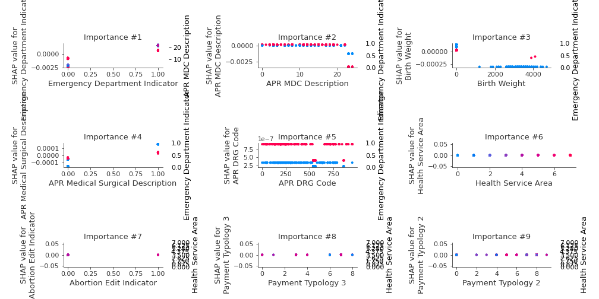

# Summary of 2_DecisionTree

[<< Go back](../README.md)

## Decision Tree
- **n_jobs**: -1
- **criterion**: gini
- **max_depth**: 3
- **num_class**: 6
- **explain_level**: 2

## Validation
 - **validation_type**: split
 - **train_ratio**: 0.75
 - **shuffle**: True
 - **stratify**: True

## Optimized metric
logloss

## Training time

28.8 seconds

### Metric details
|           |   Elective |   Emergency |    Newborn |   Not Available |   Trauma |      Urgent |   accuracy |   macro avg |   weighted avg |   logloss |
|:----------|-----------:|------------:|-----------:|----------------:|---------:|------------:|-----------:|------------:|---------------:|----------:|
| precision |   0.575    |    0.975571 |   0.990698 |               0 |        0 |   0.8125    |   0.846067 |    0.558961 |       0.884722 |  0.388353 |
| recall    |   0.979882 |    0.882081 |   0.995327 |               0 |        0 |   0.0397554 |   0.846067 |    0.482841 |       0.846067 |  0.388353 |
| f1-score  |   0.724726 |    0.926473 |   0.993007 |               0 |        0 |   0.0758017 |   0.846067 |    0.453335 |       0.827938 |  0.388353 |
| support   | 845        | 2807        | 428        |               5 |       12 | 327         |   0.846067 | 4424        |    4424        |  0.388353 |

## Confusion matrix
|                          |   Predicted as Elective |   Predicted as Emergency |   Predicted as Newborn |   Predicted as Not Available |   Predicted as Trauma |   Predicted as Urgent |
|:-------------------------|------------------------:|-------------------------:|-----------------------:|-----------------------------:|----------------------:|----------------------:|
| Labeled as Elective      |                     828 |                       17 |                      0 |                            0 |                     0 |                     0 |
| Labeled as Emergency     |                     329 |                     2476 |                      0 |                            0 |                     0 |                     2 |
| Labeled as Newborn       |                       1 |                        0 |                    426 |                            0 |                     0 |                     1 |
| Labeled as Not Available |                       1 |                        4 |                      0 |                            0 |                     0 |                     0 |
| Labeled as Trauma        |                       1 |                       11 |                      0 |                            0 |                     0 |                     0 |
| Labeled as Urgent        |                     280 |                       30 |                      4 |                            0 |                     0 |                    13 |

## Learning curves

## Decision Tree 

### Tree #1

### Rules

if (Emergency Department Indicator > 0.5) and (APR MDC Description <= 22.5) and (APR DRG Code > 3.5) then class: Emergency (proba: 98.3%) | based on 7,332 samples

if (Emergency Department Indicator <= 0.5) and (Birth Weight <= 250.0) and (APR Medical Surgical Description <= 0.5) then class: Elective (proba: 41.67%) | based on 2,119 samples

if (Emergency Department Indicator <= 0.5) and (Birth Weight <= 250.0) and (APR Medical Surgical Description > 0.5) then class: Elective (proba: 77.66%) | based on 2,055 samples

if (Emergency Department Indicator <= 0.5) and (Birth Weight > 250.0) and (CCS Diagnosis Code <= 219.5) then class: Newborn (proba: 99.38%) | based on 1,293 samples

if (Emergency Department Indicator > 0.5) and (APR MDC Description > 22.5) and (Facility Id <= 1739.0) then class: Emergency (proba: 84.88%) | based on 410 samples

if (Emergency Department Indicator > 0.5) and (APR MDC Description > 22.5) and (Facility Id > 1739.0) then class: Urgent (proba: 84.09%) | based on 44 samples

if (Emergency Department Indicator <= 0.5) and (Birth Weight > 250.0) and (CCS Diagnosis Code > 219.5) then class: Urgent (proba: 56.25%) | based on 16 samples

if (Emergency Department Indicator > 0.5) and (APR MDC Description <= 22.5) and (APR DRG Code <= 3.5) then class: Elective (proba: 50.0%) | based on 2 samples

## Permutation-based Importance

## Confusion Matrix

## Normalized Confusion Matrix

## ROC Curve

## Precision Recall Curve

## SHAP Importance

## SHAP Dependence plots

### Dependence Elective (Fold 1)

### Dependence Emergency (Fold 1)

### Dependence Newborn (Fold 1)

### Dependence Not Available (Fold 1)

### Dependence Trauma (Fold 1)

### Dependence Urgent (Fold 1)

## SHAP Decision plots

### Worst decisions for selected sample 1 (Fold 1)

### Worst decisions for selected sample 2 (Fold 1)

### Worst decisions for selected sample 3 (Fold 1)

### Worst decisions for selected sample 4 (Fold 1)

### Best decisions for selected sample 1 (Fold 1)

### Best decisions for selected sample 2 (Fold 1)

### Best decisions for selected sample 3 (Fold 1)

### Best decisions for selected sample 4 (Fold 1)

[<< Go back](../README.md)
