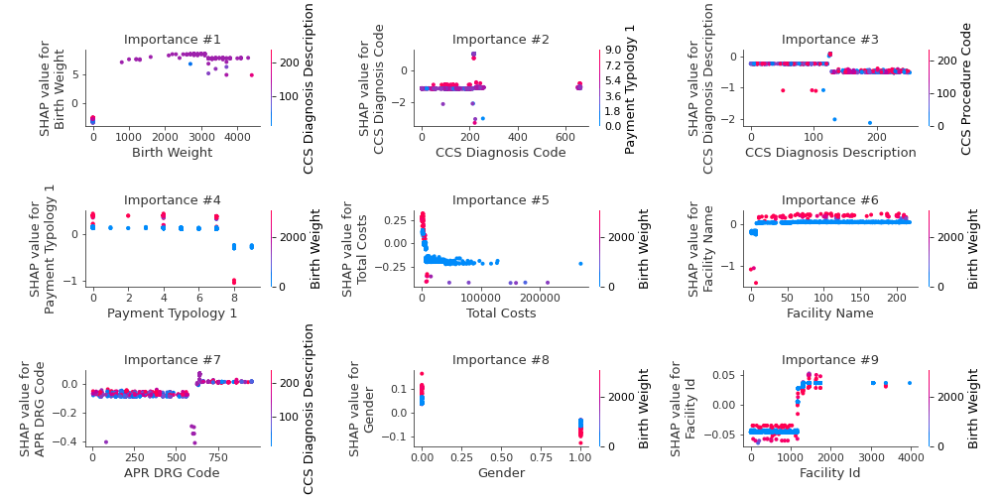

# Summary of 3_Default_Xgboost

[<< Go back](../README.md)

## Extreme Gradient Boosting (Xgboost)
- **n_jobs**: -1
- **objective**: multi:softprob
- **eta**: 0.075
- **max_depth**: 6
- **min_child_weight**: 1
- **subsample**: 1.0
- **colsample_bytree**: 1.0
- **eval_metric**: mlogloss
- **num_class**: 6
- **explain_level**: 2

## Validation
 - **validation_type**: split
 - **train_ratio**: 0.75
 - **shuffle**: True
 - **stratify**: True

## Optimized metric
logloss

## Training time

61.2 seconds

### Metric details
|           |   Elective |   Emergency |    Newborn |   Not Available |     Trauma |     Urgent |   accuracy |   macro avg |   weighted avg |   logloss |
|:----------|-----------:|------------:|-----------:|----------------:|-----------:|-----------:|-----------:|------------:|---------------:|----------:|
| precision |   0.822052 |    0.960354 |   0.990698 |        1        |  1         |   0.709677 |    0.92066 |    0.913797 |       0.918497 |  0.225148 |
| recall    |   0.891124 |    0.966512 |   0.995327 |        0.8      |  0.0833333 |   0.538226 |    0.92066 |    0.712421 |       0.92066  |  0.225148 |
| f1-score  |   0.855196 |    0.963423 |   0.993007 |        0.888889 |  0.153846  |   0.612174 |    0.92066 |    0.744423 |       0.917371 |  0.225148 |
| support   | 845        | 2807        | 428        |        5        | 12         | 327        |    0.92066 | 4424        |    4424        |  0.225148 |

## Confusion matrix
|                          |   Predicted as Elective |   Predicted as Emergency |   Predicted as Newborn |   Predicted as Not Available |   Predicted as Trauma |   Predicted as Urgent |
|:-------------------------|------------------------:|-------------------------:|-----------------------:|-----------------------------:|----------------------:|----------------------:|
| Labeled as Elective      |                     753 |                       47 |                      0 |                            0 |                     0 |                    45 |
| Labeled as Emergency     |                      69 |                     2713 |                      0 |                            0 |                     0 |                    25 |
| Labeled as Newborn       |                       0 |                        0 |                    426 |                            0 |                     0 |                     2 |
| Labeled as Not Available |                       1 |                        0 |                      0 |                            4 |                     0 |                     0 |
| Labeled as Trauma        |                       0 |                       11 |                      0 |                            0 |                     1 |                     0 |
| Labeled as Urgent        |                      93 |                       54 |                      4 |                            0 |                     0 |                   176 |

## Learning curves

## Permutation-based Importance

## Confusion Matrix

## Normalized Confusion Matrix

## ROC Curve

## Precision Recall Curve

## SHAP Importance

## SHAP Dependence plots

### Dependence Elective (Fold 1)

### Dependence Emergency (Fold 1)

### Dependence Newborn (Fold 1)

### Dependence Not Available (Fold 1)

### Dependence Trauma (Fold 1)

### Dependence Urgent (Fold 1)

## SHAP Decision plots

### Worst decisions for selected sample 1 (Fold 1)

### Worst decisions for selected sample 2 (Fold 1)

### Worst decisions for selected sample 3 (Fold 1)

### Worst decisions for selected sample 4 (Fold 1)

### Best decisions for selected sample 1 (Fold 1)

### Best decisions for selected sample 2 (Fold 1)

### Best decisions for selected sample 3 (Fold 1)

### Best decisions for selected sample 4 (Fold 1)

[<< Go back](../README.md)
