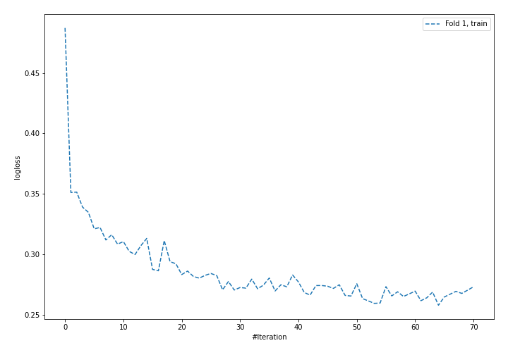
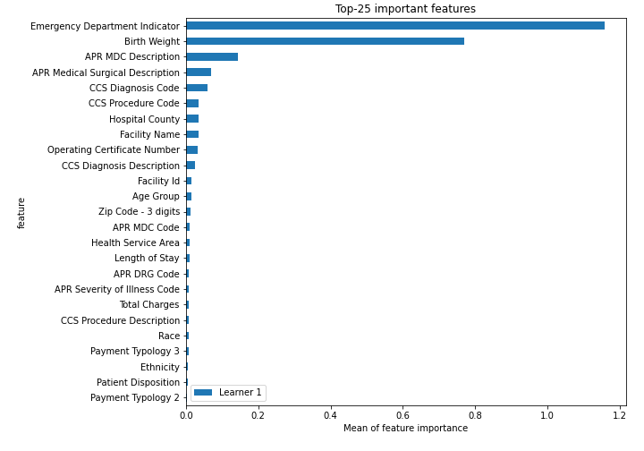
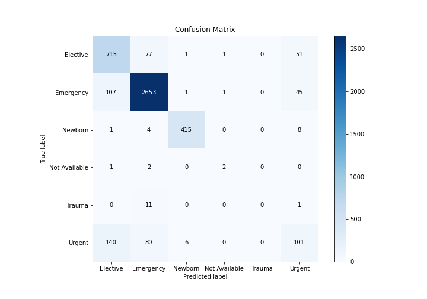
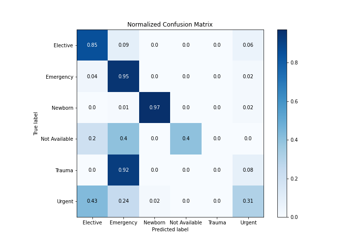
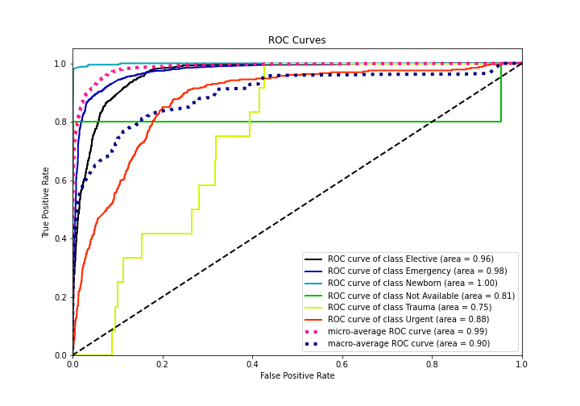
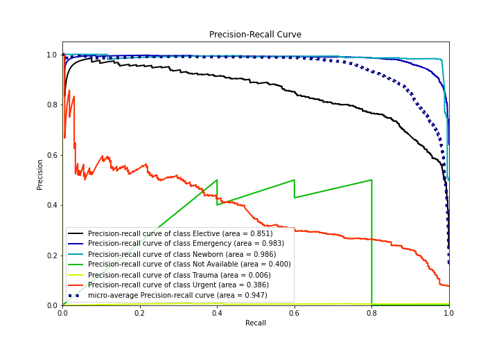

# Summary of 4_Default_NeuralNetwork

[<< Go back](../README.md)

## Neural Network
- **n_jobs**: -1
- **dense_1_size**: 32
- **dense_2_size**: 16
- **learning_rate**: 0.05
- **num_class**: 6
- **explain_level**: 2

## Validation
 - **validation_type**: split
 - **train_ratio**: 0.75
 - **shuffle**: True
 - **stratify**: True

## Optimized metric
logloss

## Training time

9.4 seconds

### Metric details
|           |   Elective |   Emergency |    Newborn |   Not Available |   Trauma |     Urgent |   accuracy |   macro avg |   weighted avg |   logloss |
|:----------|-----------:|------------:|-----------:|----------------:|---------:|-----------:|-----------:|------------:|---------------:|----------:|
| precision |   0.741701 |    0.938451 |   0.981087 |        0.5      |        0 |   0.490291 |   0.878391 |    0.608588 |       0.868829 |   0.37337 |
| recall    |   0.846154 |    0.945137 |   0.969626 |        0.4      |        0 |   0.308869 |   0.878391 |    0.578298 |       0.878391 |   0.37337 |
| f1-score  |   0.790492 |    0.941782 |   0.975323 |        0.444444 |        0 |   0.378987 |   0.878391 |    0.588505 |       0.871414 |   0.37337 |
| support   | 845        | 2807        | 428        |        5        |       12 | 327        |   0.878391 | 4424        |    4424        |   0.37337 |

## Confusion matrix
|                          |   Predicted as Elective |   Predicted as Emergency |   Predicted as Newborn |   Predicted as Not Available |   Predicted as Trauma |   Predicted as Urgent |
|:-------------------------|------------------------:|-------------------------:|-----------------------:|-----------------------------:|----------------------:|----------------------:|
| Labeled as Elective      |                     715 |                       77 |                      1 |                            1 |                     0 |                    51 |
| Labeled as Emergency     |                     107 |                     2653 |                      1 |                            1 |                     0 |                    45 |
| Labeled as Newborn       |                       1 |                        4 |                    415 |                            0 |                     0 |                     8 |
| Labeled as Not Available |                       1 |                        2 |                      0 |                            2 |                     0 |                     0 |
| Labeled as Trauma        |                       0 |                       11 |                      0 |                            0 |                     0 |                     1 |
| Labeled as Urgent        |                     140 |                       80 |                      6 |                            0 |                     0 |                   101 |

## Learning curves

## Permutation-based Importance

## Confusion Matrix

## Normalized Confusion Matrix

## ROC Curve

## Precision Recall Curve

[<< Go back](../README.md)
